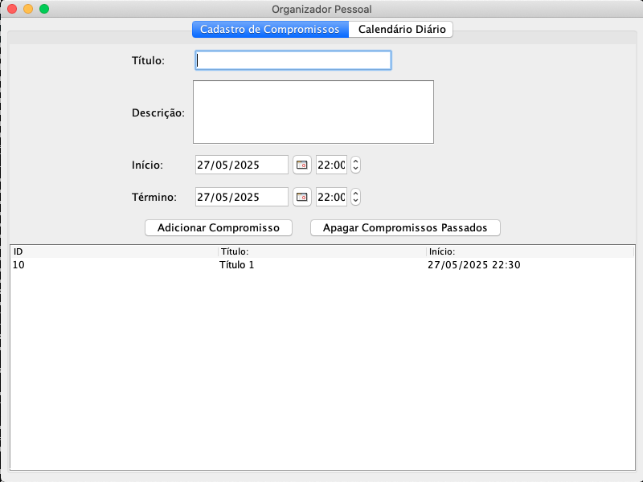
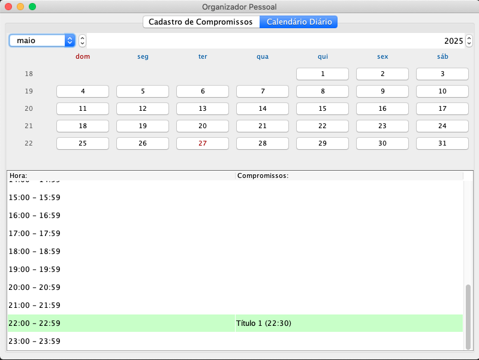

# Personal Organizer App

## Overview
The Personal Organizer App is a Java-based desktop application designed to help users schedule and manage their appointments efficiently. With a modern Swing-based interface, the app features a calendar view, real-time alerts, and persistent data storage using SQLite. The project follows the MVC (Model-View-Controller) architecture, ensuring a clear separation between business logic, the user interface, and data persistence.

## How to Run the Project

1. **Requirements:**
   - Java 8+ must be installed.
   - Ensure that the following libraries are in the `lib/` folder:
     - `sqlite-jdbc.jar` – SQLite Driver
     - `jcalendar-1.4.jar` – Calendar component library

2. **Compilation:**
   - Use the provided Makefile to compile and package the project:
     ```
     make jar
     ```
   - This command will copy resources, compile the source code to the `bin/` directory, and package the application into a runnable JAR file named `PersonalOrganizerApp.jar`.

3. **Execution:**
   - Run the application from the command line:
     ```
     java -jar PersonalOrganizerApp.jar
     ```
   - **Note:** The SQLite database is automatically created by the application on first run and should not be included in version control.

## Interface Demonstrations
- **Screenshots:**  
  - 
  - 

## Technical Decisions & Architecture
- **Architecture:**  
  The app is structured following the MVC pattern:
  - **Model:** Contains the `Task` class (representing an appointment) and handles data persistence with SQLite.
  - **View:** Comprises various Swing components for the appointment registration screen (`TaskView`), daily calendar (`CalendarView`), and edit dialogs (`EditAppointmentDialog`).
  - **Controller:** The `TaskController` acts as the mediator between the model and view, managing appointment logic.
- **Libraries & Tools:**
  - **Java Swing:** For building the graphical user interface.
  - **SQLite:** As a lightweight, file-based database to store appointment data.
  - **JCalendar:** To provide a user-friendly calendar component.
  - **Makefile:** Automates compilation and packaging.
- **Design Decisions:**
  - The MVC architecture was chosen to increase code maintainability and testability.
  - SQLite was selected due to its simplicity and ease of setup for desktop applications.
  - Custom cell renderers and localized resource bundles were implemented to enhance the user experience.

## AI Usage in Development
- **Idea Structuring & Code Generation:**  
  Parts of the code generation and idea structuring were assisted by AI tools. For example, an AI companion helped generate initial code templates, suggest architecture patterns, and even create parts of the user interface.  
- **Why AI?**  
  Using AI sped up the initial prototyping phase, helped in troubleshooting common Java Swing pitfalls, and provided ideas on how to structure the MVC architecture. The output was always reviewed and customized to fit the specific needs of the app.
- **Result:**  
  This integration of AI improved development efficiency and allowed for a more refined project structure, although all final decisions were manually validated and adapted to ensure quality.

## Creative Process & Development Notes
- The project began with brainstorming sessions to define the most user-friendly approach for managing appointments.
- Iterative prototyping was performed where UI mockups were created, tested with potential users, and then refined.
- Emphasis was placed on creating a clean separation of concerns, as well as supporting localization (with separate resource bundles for English and Portuguese).
- Frequent code reviews and testing were integral to ensure that new features (such as real-time alerts and calendar highlighting) were robust and user-friendly.

## Final Considerations
- This project serves as a robust foundation for a personal organizer app and can be further expanded with features like recurring appointments, integration with external calendars, and multi-device sync.
- Future enhancements could include performance optimizations, cloud backup, and additional user customization options.

## Contact & Further Information
- **Author:** Evandro
- **Location:** Guarujá, São Paulo, Brazil
- **Email:** [gnome_gtk2000@yahoo.com.br]

